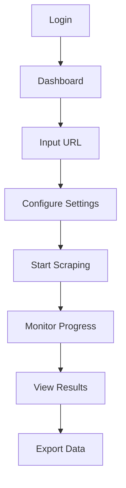

## 1. Product Overview

A web-based Google Reviews scraper that ethically extracts business reviews from public Google My Business listings. The system helps businesses and researchers analyze customer feedback without requiring ownership or admin access to the business profiles.

Target users: Market researchers, business analysts, and data professionals who need to collect and analyze public review data for competitive analysis and market insights.

## 2. Core Features

### 2.1 User Roles

| Role  | Registration Method                    | Core Permissions                                                            |
| ----- | -------------------------------------- | --------------------------------------------------------------------------- |
| Admin | Single admin account with secure login | Full access to all scraping features, data export, and system configuration |

### 2.2 Feature Module

Our Google Reviews scraper consists of the following main pages:

1. **Dashboard**: URL input form, scraping status overview, recent activities
2. **Scraping Interface**: Real-time progress monitoring, pause/resume controls, error logs
3. **Data Management**: Review listings, filtering options, export functionality
4. **Settings**: Rate limiting configuration, proxy settings, user-agent rotation

### 2.3 Page Details

| Page Name          | Module Name         | Feature description                                                              |
| ------------------ | ------------------- | -------------------------------------------------------------------------------- |
| Dashboard          | URL Input Form      | Accept Google My Business URLs, validate format, queue for processing            |
| Dashboard          | Status Overview     | Display active scrapes, success/failure rates, system health metrics             |
| Dashboard          | Activity Feed       | Show recent scraping jobs with timestamps and status                             |
| Scraping Interface | Progress Monitor    | Real-time scraping progress with percentage completion, estimated time remaining |
| Scraping Interface | Control Panel       | Start, pause, resume, and stop scraping operations                               |
| Scraping Interface | Error Console       | Display and log scraping errors with detailed messages                           |
| Data Management    | Review Listings     | Display scraped reviews with pagination, sorting, and search                     |
| Data Management    | Filter Options      | Filter by rating, date range, reviewer name, response status                     |
| Data Management    | Export Controls     | Export to JSON/CSV formats with field selection                                  |
| Settings           | Rate Limiting       | Configure delays between requests, concurrent request limits                     |
| Settings           | Proxy Configuration | Add, test, and manage proxy servers for rotation                                 |
| Settings           | User-Agent Pool     | Manage browser user-agent strings for rotation                                   |
| Settings           | Ethical Controls    | Set maximum reviews per business, respect robots.txt settings                    |

## 3. Core Process

Admin Flow:

1. Login to admin dashboard with secure credentials
2. Input target Google My Business URL in the scraping form
3. Configure scraping parameters (rate limits, proxy settings)
4. Initiate scraping job and monitor real-time progress
5. Review scraped data in the data management interface
6. Export data in desired format (JSON/CSV)

## 4. User Interface Design

### 4.1 Design Style

* **Primary Colors**: Professional blue (#2563eb) for primary actions, green (#10b981) for success states

* **Secondary Colors**: Gray (#6b7280) for secondary text, red (#ef4444) for errors

* **Button Style**: Rounded corners (8px radius), clear hover states, loading indicators

* **Font**: System fonts (Inter, -apple-system, BlinkMacSystemFont) for readability

* **Layout**: Card-based design with consistent spacing (8px grid system)

* **Icons**: Feather icons for consistency, clear visual hierarchy

### 4.2 Page Design Overview

| Page Name          | Module Name    | UI Elements                                                                                    |
| ------------------ | -------------- | ---------------------------------------------------------------------------------------------- |
| Dashboard          | URL Input Form | Large input field with URL validation, submit button with loading state, clear error messaging |
| Dashboard          | Status Cards   | Card grid showing active jobs, success rate, total reviews scraped, system status              |
| Scraping Interface | Progress Bar   | Animated progress bar with percentage, time elapsed, estimated completion time                 |
| Data Management    | Review Cards   | Clean card layout for each review showing rating, date, reviewer name, expandable text         |
| Data Management    | Export Modal   | Modal dialog with format selection, field checkboxes, file name input                          |

### 4.3 Responsiveness

* Mobile-first design approach with breakpoints at 640px, 768px, 1024px

* Touch-optimized controls with appropriate tap targets (minimum 44px)

* Responsive tables that convert to card layouts on mobile

* Coll

