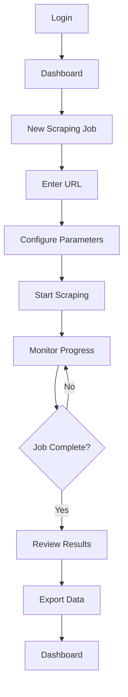

## 1. Product Overview

A modular web-based Google Reviews scraping tool that extracts business reviews from Google My Business pages using anti-detection measures and human-like behavior simulation. The system provides an admin interface for URL management, real-time progress monitoring, and data export capabilities, designed as a foundation for future expansion to other review platforms.

Target users: Business analysts, market researchers, and data professionals who need to analyze public review data for competitive intelligence and market insights.

## 2. Core Features

### 2.1 User Roles

| Role  | Registration Method                          | Core Permissions                                                                 |
| ----- | -------------------------------------------- | -------------------------------------------------------------------------------- |
| Admin | Single admin account with secure credentials | Full access to all scraping functions, data management, and system configuration |

### 2.2 Feature Module

The Google Reviews scraper consists of the following main pages:

1. **Dashboard**: Overview of scraping activities, recent jobs, and system status
2. **New Scraping Job**: URL input form with scraping parameters and anti-detection controls
3. **Progress Monitor**: Real-time scraping progress with detailed status updates
4. **Data Management**: Review data browser with filtering, search, and export functions
5. **Settings**: Configuration for scraping behavior and anti-detection parameters

### 2.3 Page Details

| Page Name        | Module Name            | Feature description                                                               |
| ---------------- | ---------------------- | --------------------------------------------------------------------------------- |
| Dashboard        | System Overview        | Display active scraping jobs, recent completions, and success rate statistics     |
| Dashboard        | Quick Actions          | Provide shortcuts to start new job, view recent data, and access settings         |
| Dashboard        | Job History            | Show chronological list of all scraping attempts with status indicators           |
| New Scraping Job | URL Input              | Accept Google My Business URL with validation and format checking                 |
| New Scraping Job | Scraping Parameters    | Configure review limits, delay settings, and anti-detection options           |
| New Scraping Job | Job Preview            | Display estimated scraping time and expected review count before starting         |
| Progress Monitor | Real-time Status       | Show current progress percentage, reviews scraped, and estimated completion time  |
| Progress Monitor | Activity Log           | Display detailed scraping activities including delays and anti-detection measures |
| Progress Monitor | Error Handling         | Show any encountered issues with automatic retry attempts and solutions           |
| Data Management  | Review Browser         | Display scraped reviews in paginated table with sortable columns                  |
| Data Management  | Advanced Filtering     | Filter by rating, date range, reviewer name, and review content keywords          |
| Data Management  | Export Options         | Export selected reviews to JSON or CSV format with customizable fields            |
| Settings         | Scraping Configuration | Adjust rate limiting, delay parameters, and anti-detection sensitivity            |
| Settings         | Anti-Detection Controls | Configure human-like delays, user-agent rotation, and stealth browsing parameters |
| Settings         | System Preferences     | Set default export formats, timezone settings, and notification preferences       |

## 3. Core Process

### Admin User Flow

1. **Login**: Access the admin dashboard with secure authentication
2. **Dashboard Overview**: Review system status and recent scraping activities
3. **Start New Job**: Click "New Scraping Job" button to open the scraping interface
4. **Enter URL**: Input the Google My Business URL and validate the format
5. **Configure Parameters**: Set review limits, delays, and anti-detection options
6. **Preview and Confirm**: Review estimated time and expected results before starting
7. **Monitor Progress**: Watch real-time scraping progress with detailed status updates
8. **Review Results**: Access completed scraping jobs and browse extracted review data
9. **Export Data**: Filter and export review data in desired format (JSON/CSV)
10. **Manage Settings**: Adjust scraping parameters and system preferences as needed

## 4. User Interface Design

### 4.1 Design Style

* **Primary Colors**: Professional blue (#2563eb) for primary actions, gray (#6b7280) for secondary elements

* **Button Style**: Rounded corners (8px radius) with hover effects and clear focus states

* **Typography**: System fonts (Inter, -apple-system, BlinkMacSystemFont) with 16px base size

* **Layout Style**: Card-based layout with consistent spacing (24px grid system)

* **Icons**: Feather icons for consistency and clarity across all interface elements

* **Status Indicators**: Color-coded badges (green for success, yellow for warning, red for errors)

### 4.2 Page Design Overview

| Page Name        | Module Name        | UI Elements                                                                              |
| ---------------- | ------------------ | ---------------------------------------------------------------------------------------- |
| Dashboard        | Header             | Navigation bar with logo, user menu, and system status indicator                         |
| Dashboard        | Metrics Cards      | Three cards showing active jobs, success rate, and total reviews scraped                 |
| Dashboard        | Recent Jobs Table  | Sortable table with job ID, URL, status, progress bar, and completion time               |
| New Scraping Job | URL Input Form     | Text input with URL validation, format examples, and real-time feedback                  |
| New Scraping Job | Parameter Controls | Sliders for review limits, number inputs for delays, toggle switches for anti-detection options |
| New Scraping Job | Preview Panel      | Information card showing estimated time, review count, and anti-detection status       |
| Progress Monitor | Progress Bar       | Animated progress bar with percentage and review count display                           |
| Progress Monitor | Status Timeline    | Vertical timeline showing scraping milestones and current activity                       |
| Progress Monitor | Error Alert        | Expandable alert panels with error details and automatic retry information               |
| Data Management  | Review Table       | Responsive table with review text preview, rating stars, date, and reviewer name         |
| Data Management  | Filter Panel       | Collapsible sidebar with filter controls and search functionality                        |
| Data Management  | Export Modal       | Modal dialog with format selection, field customization, and download options            |
| Settings         | Configuration Tabs | Tabbed interface for scraping, anti-detection, and general settings                    |
| Settings         | Form Controls      | Input fields, dropdowns, and toggles with inline help text and validation                |

### 4.3 Responsiveness

* **Desktop-First**: Optimized for desktop use with 1200px minimum width

* **Tablet Support**: Responsive layout adapts to 768px+ screens with touch-friendly controls

* **Mobile Considerations**: Basic mobile support for emergency monitoring and status checking

* **Touch Optimization**: Larger click targets (44px minimum) and swipe gestures for navigation

## 5. Anti-Detection Measures

### 5.1 Human Behavior Simulation

* Default human-like delay: 2000-8000ms random intervals between actions

* Configurable delay range: 1000ms to 15000ms with randomization

* Mouse movement patterns that mimic real user behavior

* Realistic page scrolling with variable speed and pause patterns

* Random click patterns and hover behaviors

### 5.2 Stealth Browsing Techniques

* User-Agent rotation with realistic browser profiles (Chrome, Firefox, Safari)

* Browser fingerprint randomization (screen resolution, timezone, fonts)

* Request header randomization and ordering

* JavaScript execution patterns that appear human-like

* Canvas fingerprint protection and WebGL noise injection

### 5.3 Spam Detection Avoidance

* Rate limiting that mimics human browsing patterns (not robotic)

* Realistic page interaction sequences (scroll before click, hover before action)

* Proxy rotation support for IP diversity when needed

* Session management with realistic duration patterns

* Anti-bot challenge detection and graceful handling

## 6. Error Handling Requirements

### 6.1 Page Structure Changes

* Automatic selector detection and fallback mechanisms

* Structure change alerts with suggested updates

* Graceful degradation when elements are missing

* Manual selector override capability

### 6.2 Connection Issues

* Automatic retry with exponential backoff (max 5 attempts)

* Network timeout handling (30-second default)

* Proxy failover on connection failures

* Clear error messaging with suggested solutions

### 6.3 Detection Triggers

* CAPTCHA detection with automatic job pause

* Rate limit recognition and adaptive delay adjustment

* IP blocking detection with proxy rotation

* Account suspension prevention measures

## 7. Data Export Specifications

### 7.1 JSON Format

* Complete review objects with all metadata

* Nested structure for business responses

* Timestamp and scraping job references

* UTF-8 encoding for international characters

### 7.2 CSV Format

* Flat file structure with one review per row

* Configurable column selection

* Date formatting options (ISO 8601 default)

* Proper escaping for special characters

### 7.3 Export Options

* Selective export by date range, rating, or search criteria

* Batch export with progress indication

* Scheduled exports with email notifications

* Data anonymization options for privacy compliance

