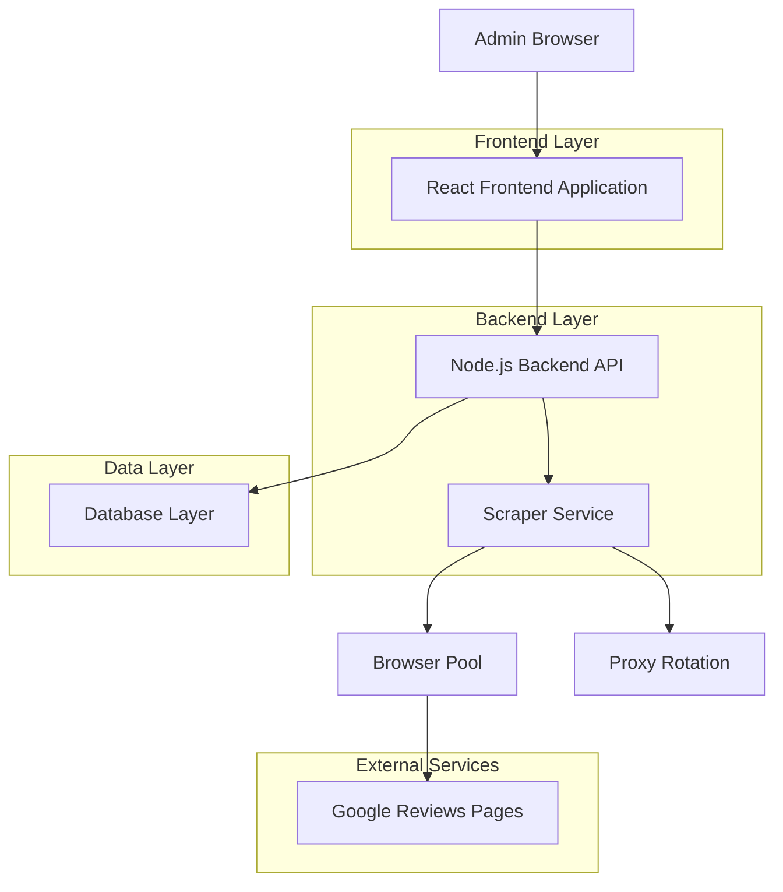
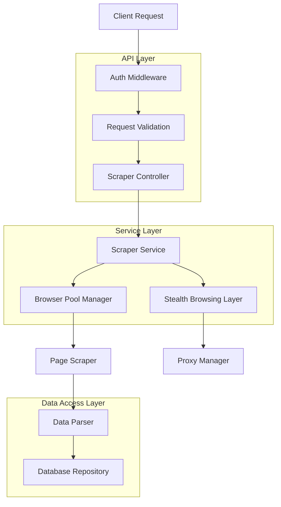
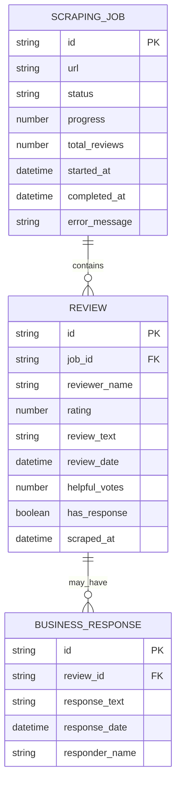

## 1. Architecture Design



## 2. Technology Description

* **Frontend**: React\@18 + TailwindCSS\@3 + Vite

* **Backend**: Node.js\@18 + Express\@4

* **Database**: SQLite3 (local storage) + JSON export capability

* **Browser Automation**: Puppeteer\@19 with stealth plugin and human behavior simulation

* **Queue Management**: Bull\@4 with Redis (optional)

## 3. Route Definitions

| Route                | Purpose                                                    |
| -------------------- | ---------------------------------------------------------- |
| /                    | Dashboard with URL input and status overview               |
| /scraping            | Real-time scraping interface with progress monitoring      |
| /data                | Review data management and filtering interface             |
| /settings            | Configuration for scraping parameters and anti-detection controls |
| /api/auth/login      | Admin authentication endpoint                              |
| /api/scraping/start  | Initiate new scraping job                                  |
| /api/scraping/status | Get current scraping progress and status                   |
| /api/scraping/stop   | Stop active scraping job                                   |
| /api/reviews         | Fetch scraped reviews with pagination and filtering        |
| /api/reviews/export  | Export reviews in JSON/CSV format                          |
| /api/settings        | Update scraping configuration settings                     |

## 4. API Definitions

### 4.1 Scraping API

Start Scraping Job

```
POST /api/scraping/start
```

Request:

| Param Name | Param Type | isRequired | Description                                  |
| ---------- | ---------- | ---------- | -------------------------------------------- |
| url        | string     | true       | Google My Business URL                       |
| maxReviews | number     | false      | Maximum reviews to scrape (default: 100)     |
| delay      | number     | false      | Delay between requests in ms (default: 2000) |
| useProxy   | boolean    | false      | Enable proxy rotation (default: false)       |

Response:

| Param Name    | Param Type | Description                                            |
| ------------- | ---------- | ------------------------------------------------------ |
| jobId         | string     | Unique identifier for the scraping job                 |
| status        | string     | Job status: 'queued', 'running', 'completed', 'failed' |
| estimatedTime | number     | Estimated completion time in minutes                   |

### 4.2 Review Data API

Get Reviews with Filtering

```
GET /api/reviews
```

Query Parameters:

| Param Name | Param Type | Description                                 |
| ---------- | ---------- | ------------------------------------------- |
| page       | number     | Page number for pagination                  |
| limit      | number     | Items per page (max: 100)                   |
| rating     | number     | Filter by rating (1-5)                      |
| startDate  | string     | Filter reviews from this date (ISO format)  |
| endDate    | string     | Filter reviews until this date (ISO format) |
| search     | string     | Search in review text and reviewer name     |

## 5. Server Architecture Diagram



## 6. Data Model

### 6.1 Data Model Definition



### 6.2 Data Definition Language

Scraping Jobs Table

```sql
CREATE TABLE scraping_jobs (
    id TEXT PRIMARY KEY,
    url TEXT NOT NULL,
    status TEXT NOT NULL CHECK (status IN ('queued', 'running', 'completed', 'failed')),
    progress INTEGER DEFAULT 0,
    total_reviews INTEGER DEFAULT 0,
    started_at DATETIME,
    completed_at DATETIME,
        error_message TEXT,
        anti_detection_config TEXT,
        created_at DATETIME DEFAULT CURRENT_TIMESTAMP
);

CREATE INDEX idx_jobs_status ON scraping_jobs(status);
CREATE INDEX idx_jobs_created ON scraping_jobs(created_at DESC);
```

Reviews Table

```sql
CREATE TABLE reviews (
    id TEXT PRIMARY KEY,
    job_id TEXT NOT NULL,
    reviewer_name TEXT NOT NULL,
    rating INTEGER NOT NULL CHECK (rating >= 1 AND rating <= 5),
    review_text TEXT NOT NULL,
    review_date DATETIME NOT NULL,
    helpful_votes INTEGER DEFAULT 0,
    has_response BOOLEAN DEFAULT FALSE,
    scraped_at DATETIME DEFAULT CURRENT_TIMESTAMP,
    FOREIGN KEY (job_id) REFERENCES scraping_jobs(id)
);

CREATE INDEX idx_reviews_job ON reviews(job_id);
CREATE INDEX idx_reviews_rating ON reviews(rating);
CREATE INDEX idx_reviews_date ON reviews(review_date DESC);
```

## 7. Anti-Detection Implementation

### 7.1 Human Behavior Simulation

* Human-like delays: 2000-8000ms random intervals between actions

* Mouse movement patterns with realistic curves and pauses

* Page scrolling with variable speed and natural pause patterns

* Random click patterns and hover behaviors before actions

* Realistic session duration management

### 7.2 Stealth Browsing Techniques

* User-Agent rotation with realistic browser profiles (Chrome, Firefox, Safari)

* Browser fingerprint randomization (screen resolution, timezone, fonts)

* Request header randomization and ordering variations

* Canvas fingerprint protection and WebGL noise injection

* JavaScript execution patterns that appear human-like

### 7.3 Spam Detection Avoidance

* Rate limiting that mimics human browsing patterns (not robotic sequences)

* Realistic page interaction sequences (scroll before click, hover before action)

* Anti-bot challenge detection with graceful pause and resume

* IP rotation support when detection patterns are triggered

* Behavioral randomization to avoid pattern recognition

## 8. Error Handling Strategy

### 8.1 Page Structure Changes

* Selector fallback mechanisms

* Structure change detection

* Graceful degradation

* Automatic selector updates

### 8.2 Connection Issues

* Retry mechanisms with exponential backoff

* Network timeout handling

* Proxy failover systems

* Connection pool management

### 8.3 Detection Triggers

* CAPTCHA detection and pause

* Rate limit recognition

* IP blocking detection

* Automatic proxy rotation on detection

## 9. Modular Architecture for Future Expansion

### 9.1 Platform Abstraction Layer

```javascript
class ReviewPlatformScraper {
    constructor(config) {
        this.config = config;
        this.browserPool = new BrowserPool();
        this.antiDetection = new AntiDetectionLayer();
    }
    
    async scrape(url, options) {
        // Abstract method for platform-specific implementation
        throw new Error('Must implement scrape method');
    }
}
```

### 9.2 Plugin Architecture

* Platform-specific scraper plugins

* Configurable data extractors

* Modular anti-detection strategies

* Extensible export formats

### 9.3 Future Platform Support

* Yelp integration module

* TripAdvisor scraper

* Facebook reviews support

* Amazon product reviews

* Custom platform adapters

