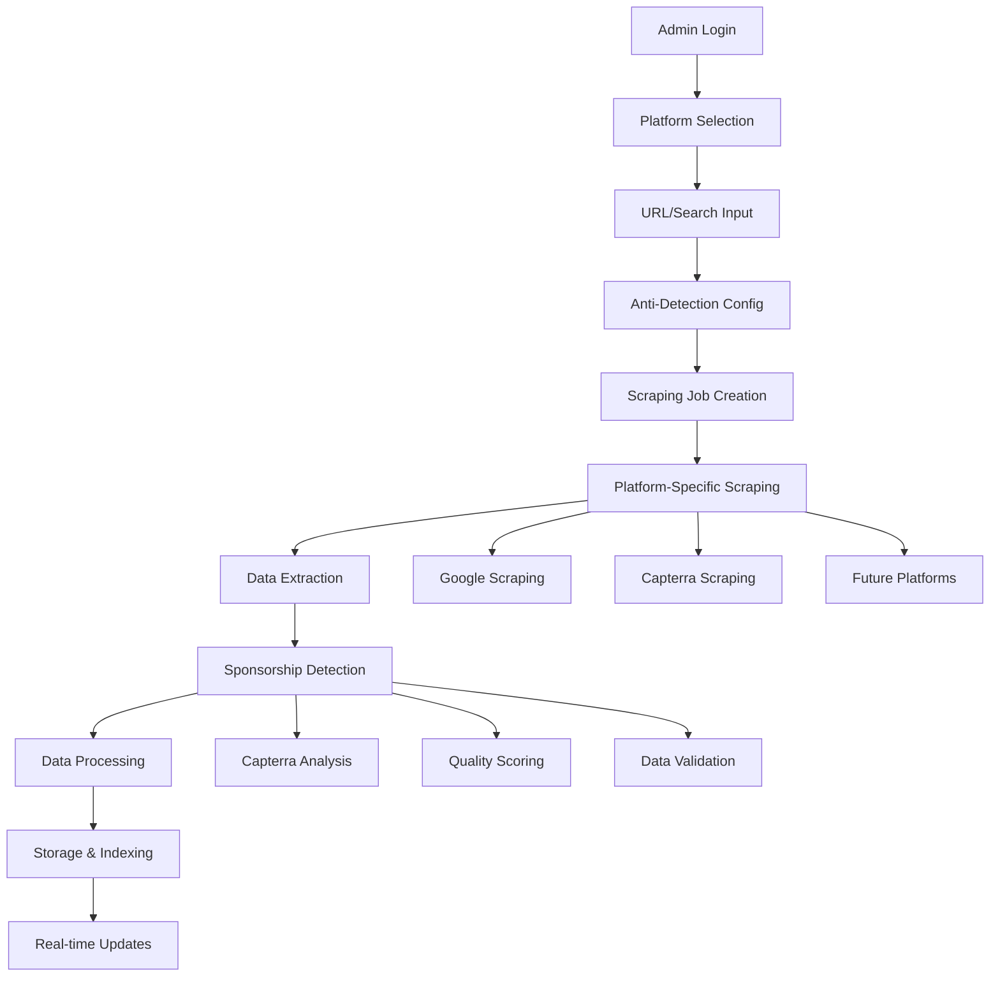
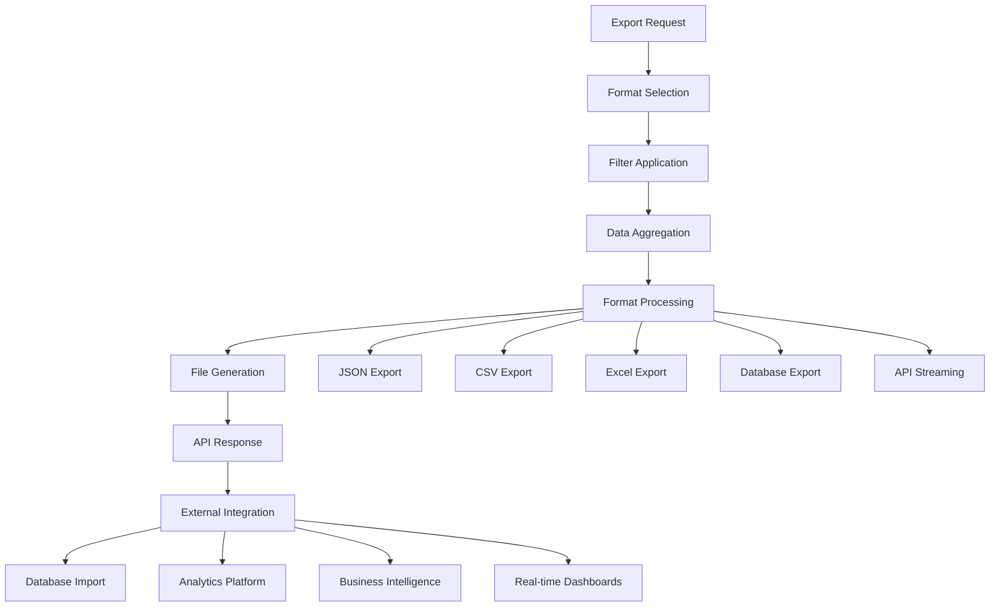

## 1. Product Overview

A comprehensive multi-platform review scraper that extracts business reviews from Google Reviews, Capterra, and other platforms. The system provides advanced anti-detection capabilities, paid sponsorship identification, and modular architecture for clean, maintainable code.

Target users: Market researchers, business analysts, and data professionals who need to collect and analyze public review data across multiple platforms for competitive analysis and market insights.

**Key Differentiators:**
- Multi-platform support with unified API
- Advanced anti-detection measures for each platform
- Paid sponsorship review identification (Capterra)
- Modular, extensible architecture
- Comprehensive export and API integration capabilities

## 2. Platform Analysis & Difficulty Assessment

### 2.1 Platform Comparison Matrix

| Platform | Difficulty Level | Anti-Bot Sophistication | Success Rate (Beginner) | Success Rate (Advanced) | Key Challenges |
|----------|------------------|-------------------------|----------------------|----------------------|----------------|
| Google Reviews | HARD | Very High | 10-30% | 85-95% | Hardware fingerprinting, behavioral analysis, dynamic content |
| Yelp | HARD | High | 15-35% | 70-85% | Hardware fingerprinting, CAPTCHAs, rate limiting |
| Capterra | MODERATE | Medium | 60-80% | 90-95% | Standard Cloudflare protection, basic rate limiting |

### 2.2 Platform-Specific Anti-Detection Requirements

**Google Reviews:**
- Hardware fingerprint simulation (GPU/CPU signatures)
- Advanced behavioral analysis bypass
- JavaScript challenge handling
- Real browser fingerprint randomization
- Mouse movement pattern simulation

**Yelp:**
- Hardware fingerprint bypass
- Human-like interaction patterns
- CAPTCHA detection and handling
- Real hardware execution when possible
- Sophisticated rate limiting evasion

**Capterra:**
- Standard proxy rotation
- User-agent rotation
- Request spacing and headers
- Basic behavioral simulation
- Cloudflare bypass techniques

## 3. Core Features

### 3.1 User Roles

| Role | Registration Method | Core Permissions |
|------|---------------------|------------------|
| Admin | Single admin account with secure login | Full access to all scraping features, data export, system configuration, API management |
| API User | API key authentication | Programmatic access to scraped data, limited scraping initiation |

### 3.2 Multi-Platform Scraping Module

**Platform Support:**
1. **Google Reviews**: Business reviews with advanced anti-detection
2. **Capterra**: Software reviews with sponsorship detection
3. **Extensible**: Plugin architecture for additional platforms

**Core Modules:**
1. **Platform Manager**: Unified interface for all platforms
2. **Anti-Detection Engine**: Platform-specific evasion techniques
3. **Data Extractor**: Standardized review data extraction
4. **Export System**: Multiple format exports with API integration
5. **Analysis Pipeline**: Data processing and insights generation

### 3.3 Page Details

| Page Name | Module Name | Feature Description |
|-----------|-------------|---------------------|
| Dashboard | Platform Selector | Choose target platform (Google, Capterra, etc.) with platform-specific settings |
| Dashboard | Job Queue Manager | View and manage scraping jobs across all platforms with unified status display |
| Dashboard | Analytics Overview | Display success rates, platform performance metrics, data volume statistics |
| Platform Config | Anti-Detection Settings | Configure platform-specific evasion techniques and parameters |
| Platform Config | Rate Limiting | Set platform-specific delays and concurrent request limits |
| Data Explorer | Multi-Platform View | Browse reviews from all platforms with unified filtering and search |
| Data Explorer | Sponsorship Detection | Identify and filter paid/sponsored reviews (Capterra-specific) |
| Export Center | Format Selection | Export in JSON, CSV, Excel, or direct database integration |
| Export Center | API Configuration | Set up API endpoints for external data consumption |
| Analysis Tools | Sentiment Analysis | Basic sentiment scoring for collected reviews |
| Analysis Tools | Competitive Analysis | Compare review metrics across platforms and competitors |

## 4. Capterra-Specific Features

### 4.1 Paid Sponsorship Detection

**Detection Methods:**
1. **Review Content Analysis**: Identify promotional language patterns
2. **Reviewer Profile Analysis**: Check for suspicious reviewer accounts
3. **Timing Pattern Analysis**: Detect unnatural review timing clusters
4. **Language Pattern Recognition**: Identify marketing-style language
5. **Rating Distribution Analysis**: Spot artificial rating patterns

**Sponsorship Indicators:**
- Overly positive language with specific product mentions
- Generic praise without specific details
- Reviews posted in clusters around product launches
- Reviewers with only one review or very few reviews
- Use of marketing terminology and buzzwords
- Perfect 5-star ratings with vague descriptions

**Scoring System:**
- **High Confidence (80-100%)**: Multiple sponsorship indicators detected
- **Medium Confidence (50-79%)**: Some suspicious patterns identified
- **Low Confidence (20-49%)**: Minor irregularities detected
- **Likely Genuine (0-19%)**: No significant sponsorship indicators

### 4.2 Capterra Anti-Detection Strategy

**Technical Approach:**
- Standard browser automation with realistic headers
- Proxy rotation for IP diversity
- Human-like request spacing (2-8 second delays)
- User-agent rotation with realistic profiles
- Cookie management and session handling

**Behavioral Simulation:**
- Realistic page navigation patterns
- Mouse movement simulation
- Scroll behavior randomization
- Click timing variation
- Form interaction delays

## 5. Modular Architecture Design

### 5.1 Core Architecture Components

**Platform Abstraction Layer:**
```
interfaces/
├── IPlatformScraper.ts      # Base interface for all platforms
├── IAntiDetection.ts        # Anti-detection strategy interface
├── IDataExtractor.ts        # Data extraction interface
└── IExportAdapter.ts        # Export format interface
```

**Platform Implementations:**
```
platforms/
├── google/
│   ├── GoogleScraper.ts     # Google-specific implementation
│   ├── GoogleAntiDetection.ts
│   └── GoogleExtractor.ts
├── capterra/
│   ├── CapterraScraper.ts   # Capterra-specific implementation
│   ├── CapterraAntiDetection.ts
│   ├── CapterraExtractor.ts
│   └── SponsorshipDetector.ts
└── base/
    ├── BaseScraper.ts       # Common scraping functionality
    └── BaseAntiDetection.ts
```

**Service Layer:**
```
services/
├── ScrapingOrchestrator.ts  # Coordinates multi-platform scraping
├── AntiDetectionManager.ts  # Manages platform-specific evasion
├── DataProcessor.ts         # Processes and standardizes review data
├── ExportManager.ts         # Handles all export formats
├── APIService.ts            # External API integration
└── AnalyticsService.ts      # Data analysis and insights
```

### 5.2 Plugin Architecture

**Extensibility Features:**
- Dynamic platform loading via configuration
- Plugin registration system for new platforms
- Standardized data format across all platforms
- Configurable anti-detection modules
- Custom extractor plugins

**Configuration System:**
```json
{
  "platforms": {
    "google": {
      "enabled": true,
      "anti_detection": "advanced",
      "rate_limits": {"min_delay": 2000, "max_delay": 8000}
    },
    "capterra": {
      "enabled": true,
      "anti_detection": "standard",
      "sponsorship_detection": true,
      "rate_limits": {"min_delay": 1000, "max_delay": 3000}
    }
  }
}
```

## 6. Export & API Integration System

### 6.1 Export Formats

**Supported Formats:**
1. **JSON**: Complete data with metadata for analysis systems
2. **CSV**: Standard format for spreadsheet applications
3. **Excel**: Formatted spreadsheets with multiple sheets
4. **Database**: Direct integration with PostgreSQL, MySQL, MongoDB
5. **API**: Real-time data access via REST endpoints

**Export Features:**
- Field selection and custom mapping
- Date range filtering
- Platform-specific data inclusion/exclusion
- Scheduled exports with automation
- Compression options for large datasets

### 6.2 API Design

**REST API Endpoints:**
```
GET /api/v1/reviews          # Fetch reviews with filtering
GET /api/v1/reviews/:id      # Get specific review details
POST /api/v1/scraping/jobs   # Start new scraping job
GET /api/v1/scraping/jobs    # List scraping jobs
GET /api/v1/analytics        # Get analysis data
POST /api/v1/export          # Trigger data export
```

**GraphQL API (Alternative):**
```graphql
type Query {
  reviews(platform: String, filters: ReviewFilters): ReviewConnection
  scrapingJobs(status: String): [ScrapingJob]
  analytics(platform: String, dateRange: DateRange): AnalyticsData
}

type Review {
  id: ID!
  platform: String!
  reviewerName: String!
  rating: Int!
  reviewText: String!
  reviewDate: DateTime!
  sponsorshipScore: Float # Capterra-specific
  sentimentScore: Float
}
```

### 6.3 Database Integration

**Schema Extensions:**
```sql
-- Platform-specific tables
CREATE TABLE platform_configs (
    id TEXT PRIMARY KEY,
    platform_name TEXT NOT NULL,
    anti_detection_level TEXT,
    rate_limit_min INTEGER,
    rate_limit_max INTEGER,
    sponsorship_detection BOOLEAN,
    config_json TEXT
);

-- Enhanced reviews table with platform data
CREATE TABLE reviews (
    id TEXT PRIMARY KEY,
    job_id TEXT,
    platform TEXT NOT NULL,
    reviewer_name TEXT,
    rating INTEGER,
    review_text TEXT,
    review_date DATETIME,
    sponsorship_score REAL, -- Capterra-specific
    sponsorship_confidence TEXT,
    sentiment_score REAL,
    platform_specific_data TEXT, -- JSON for platform-specific fields
    scraped_at DATETIME DEFAULT CURRENT_TIMESTAMP
);

-- Export jobs tracking
CREATE TABLE export_jobs (
    id TEXT PRIMARY KEY,
    format TEXT NOT NULL,
    filters TEXT, -- JSON
    status TEXT,
    file_path TEXT,
    api_endpoint TEXT,
    created_at DATETIME DEFAULT CURRENT_TIMESTAMP
);
```

## 7. Data Analysis Pipeline

### 7.1 Real-time Processing

**Processing Steps:**
1. **Data Validation**: Verify review data integrity
2. **Deduplication**: Remove duplicate reviews across platforms
3. **Standardization**: Normalize rating scales and date formats
4. **Enrichment**: Add sentiment analysis and metadata
5. **Sponsorship Detection**: Capterra-specific analysis
6. **Quality Scoring**: Assign data quality scores

### 7.2 Analysis Features

**Sentiment Analysis:**
- Basic sentiment scoring (positive/neutral/negative)
- Aspect-based sentiment analysis
- Emotion detection in review text
- Comparative sentiment across platforms

**Competitive Analysis:**
- Cross-platform review comparison
- Rating trend analysis
- Review volume comparison
- Response time analysis

**Sponsorship Insights:**
- Sponsored review percentage by platform
- Sponsorship trend analysis over time
- Platform comparison for sponsorship rates
- Impact analysis on overall ratings

## 8. Core Process Flows

### 8.1 Multi-Platform Scraping Flow



### 8.2 Data Export & API Flow



## 9. User Interface Design

### 9.1 Design System

**Visual Hierarchy:**
- **Primary Actions**: Blue (#2563eb) for main CTAs
- **Success States**: Green (#10b981) for completed operations
- **Warning States**: Yellow (#f59e0b) for sponsorship detection
- **Error States**: Red (#ef4444) for failures and blocks
- **Neutral Elements**: Gray (#6b7280) for secondary information

**Component Library:**
- Platform-specific icons and branding
- Progress indicators with platform logos
- Sponsorship confidence badges
- Real-time status indicators
- Interactive data visualizations

### 9.2 Key Interface Components

**Multi-Platform Dashboard:**
- Platform selection cards with difficulty indicators
- Unified job queue with platform-specific status
- Real-time success rate metrics per platform
- Cross-platform data volume comparison

**Sponsorship Detection Interface:**
- Confidence score visualization
- Review highlighting with sponsorship indicators
- Filtering by sponsorship confidence
- Detailed analysis breakdown per review

**Export Configuration:**
- Format selection with preview
- Field mapping interface
- API endpoint configuration
- Scheduled export setup
- Data quality filters

## 10. Performance & Scaling Considerations

### 10.1 Scaling Strategy

**Horizontal Scaling:**
- Microservices architecture for platform scrapers
- Container-based deployment with Docker
- Load balancing for high-volume scraping
- Queue-based job distribution

**Performance Optimization:**
- Browser pool management for efficiency
- Intelligent caching for repeated requests
- Parallel processing for data analysis
- Database indexing for fast queries

### 10.2 Rate Limiting & Throttling

**Platform-Specific Limits:**
- Google: 2000-8000ms delays, max 2 concurrent
- Capterra: 1000-3000ms delays, max 5 concurrent
- Configurable per-platform settings
- Adaptive throttling based on response patterns

**Resource Management:**
- Memory usage monitoring for browser pools
- CPU throttling for background processing
- Disk space management for exports
- Network bandwidth optimization

## 11. Error Handling & Monitoring

### 11.1 Error Classification

**Platform-Specific Errors:**
- Anti-bot detection and blocking
- CAPTCHA challenges
- Rate limiting violations
- Page structure changes
- Network timeouts

**System Errors:**
- Browser automation failures
- Database connection issues
- Memory exhaustion
- Export processing errors
- API authentication failures

### 11.2 Monitoring & Alerting

**Key Metrics:**
- Success rates per platform
- Anti-detection trigger frequency
- Scraping speed and efficiency
- Data quality scores
- API response times

**Alert Conditions:**
- Success rate drops below threshold
- Anti-detection failures spike
- Platform structure changes detected
- System resource exhaustion
- API errors increase

## 12. Security & Compliance

### 12.1 Data Security

**Protection Measures:**
- API key authentication and rotation
- Database encryption for sensitive data
- Secure export file handling
- Rate limiting for API endpoints
- Audit logging for all operations

### 12.2 Privacy Considerations

**Data Handling:**
- Anonymization of reviewer personal data
- Compliance with platform terms of service
- Respect for robots.txt when possible
- Data retention policies
- Secure deletion capabilities

This comprehensive specification provides the foundation for building a robust, scalable, and maintainable multi-platform review scraper with advanced anti-detection