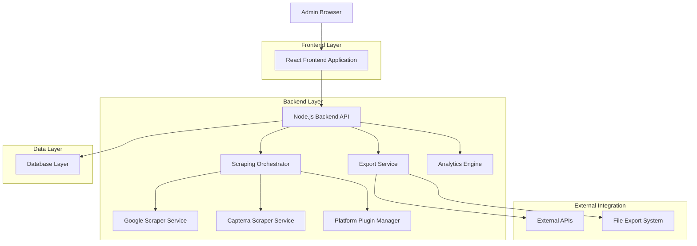
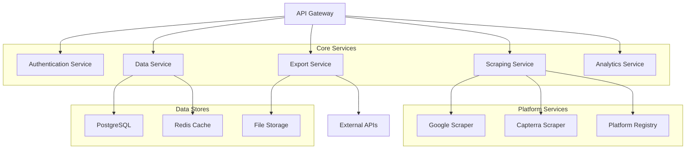
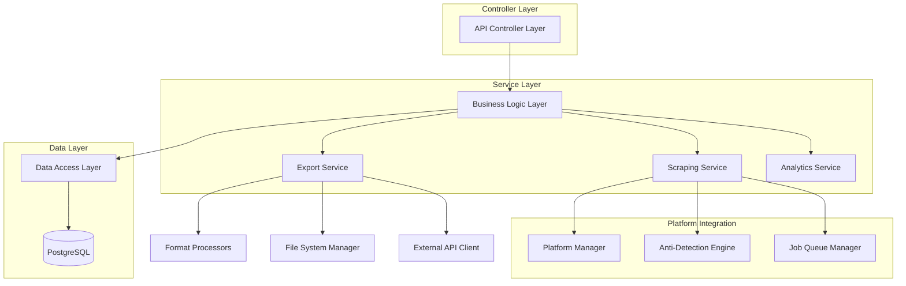
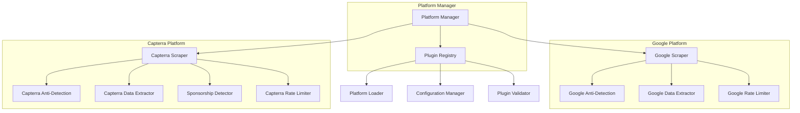
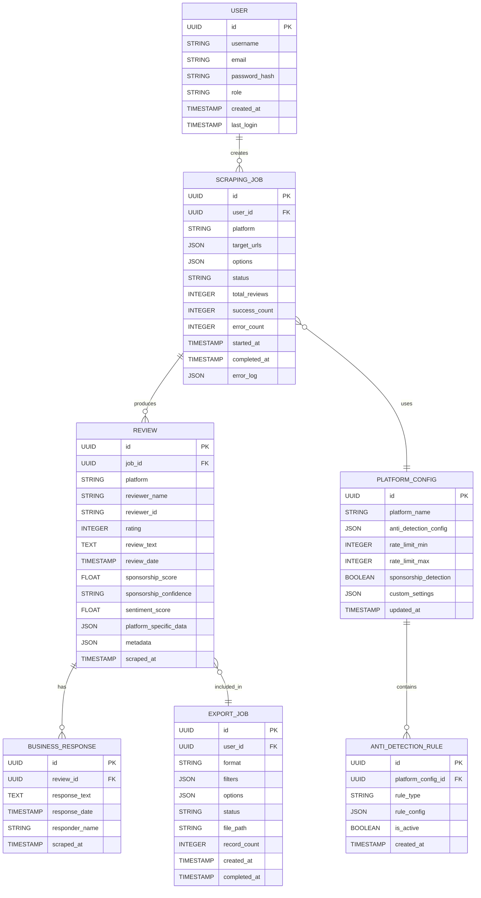

## 1. Architecture Design

### 1.1 High-Level System Architecture



### 1.2 Microservices Architecture



## 2. Technology Stack

### 2.1 Frontend Technologies
- **React 18** with TypeScript for type safety
- **Tailwind CSS 3** for responsive styling
- **Vite** for fast development and building
- **React Query** for server state management
- **Zustand** for client state management
- **React Hook Form** for form handling
- **Chart.js** for data visualization

### 2.2 Backend Technologies
- **Node.js 18** with Express.js framework
- **TypeScript** for type-safe development
- **PostgreSQL** for primary data storage
- **Redis** for caching and job queues
- **Bull** for background job processing
- **Winston** for logging and monitoring
- **Jest** for unit testing
- **Supertest** for API testing

### 2.3 Scraping Technologies
- **Puppeteer** with stealth plugin for browser automation
- **Playwright** as alternative browser engine
- **BrowserQL** for advanced anti-detection (Yelp/Google)
- **Rotating proxy services** (ScraperAPI, Scrapfly)
- **User-agent rotation** libraries
- **Fingerprint randomization** tools

### 2.4 Infrastructure & DevOps
- **Docker** for containerization
- **Docker Compose** for local development
- **Nginx** for reverse proxy and load balancing
- **PM2** for process management
- **GitHub Actions** for CI/CD
- **Prometheus** for monitoring
- **Grafana** for dashboards

## 3. Route Definitions

### 3.1 Frontend Routes

| Route | Purpose | Components |
|-------|---------|------------|
| / | Dashboard with platform overview and quick stats |
| /platforms | Platform management and configuration |
| /scraping/jobs | Job queue management and monitoring |
| /scraping/new | New scraping job creation wizard |
| /data/reviews | Multi-platform review browser with filters |
| /data/export | Export configuration and management |
| /analytics | Data analysis and insights dashboard |
| /api/docs | API documentation and testing interface |
| /settings | System configuration and user preferences |

### 3.2 API Routes

| Route | Method | Purpose |
|-------|--------|---------|
| /api/v1/auth/login | POST | User authentication |
| /api/v1/auth/logout | POST | User logout |
| /api/v1/platforms | GET | List available platforms |
| /api/v1/platforms/:id | GET | Platform configuration |
| /api/v1/platforms/:id | PUT | Update platform settings |
| /api/v1/scraping/jobs | GET | List scraping jobs |
| /api/v1/scraping/jobs | POST | Create new scraping job |
| /api/v1/scraping/jobs/:id | GET | Get job details |
| /api/v1/scraping/jobs/:id | DELETE | Cancel scraping job |
| /api/v1/reviews | GET | Get reviews with filtering |
| /api/v1/reviews/:id | GET | Get specific review |
| /api/v1/analytics/overview | GET | Get analytics overview |
| /api/v1/analytics/platforms | GET | Platform performance data |
| /api/v1/export/formats | GET | Available export formats |
| /api/v1/export/jobs | POST | Create export job |
| /api/v1/export/jobs/:id | GET | Get export job status |
| /api/v1/export/jobs/:id/download | GET | Download exported file |

## 4. API Definitions

### 4.1 Authentication API

**Login Endpoint**
```
POST /api/v1/auth/login
```

Request:
```json
{
  "username": "admin",
  "password": "secure_password"
}
```

Response:
```json
{
  "success": true,
  "token": "eyJhbGciOiJIUzI1NiIsInR5cCI6IkpXVCJ9...",
  "user": {
    "id": "user_123",
    "username": "admin",
    "role": "admin"
  }
}
```

### 4.2 Scraping Job API

**Create Scraping Job**
```
POST /api/v1/scraping/jobs
```

Request:
```json
{
  "platform": "google",
  "target_urls": ["https://maps.google.com/place?id=123"],
  "options": {
    "max_reviews": 100,
    "include_responses": true,
    "language": "en",
    "anti_detection_level": "advanced"
  },
  "schedule": {
    "type": "immediate"
  }
}
```

Response:
```json
{
  "success": true,
  "job": {
    "id": "job_456",
    "platform": "google",
    "status": "queued",
    "created_at": "2024-01-15T10:30:00Z",
    "estimated_completion": "2024-01-15T10:45:00Z"
  }
}
```

### 4.3 Reviews API

**Get Reviews with Filtering**
```
GET /api/v1/reviews?platform=google&rating=4,5&date_from=2024-01-01&limit=50&offset=0
```

Response:
```json
{
  "success": true,
  "data": {
    "reviews": [
      {
        "id": "review_789",
        "platform": "google",
        "job_id": "job_456",
        "reviewer_name": "John Doe",
        "rating": 5,
        "review_text": "Excellent service!",
        "review_date": "2024-01-10T14:30:00Z",
        "sponsorship_score": null,
        "sentiment_score": 0.85,
        "scraped_at": "2024-01-15T10:35:00Z"
      }
    ],
    "pagination": {
      "total": 150,
      "limit": 50,
      "offset": 0,
      "has_next": true
    }
  }
}
```

### 4.4 Export API

**Create Export Job**
```
POST /api/v1/export/jobs
```

Request:
```json
{
  "format": "csv",
  "filters": {
    "platform": "capterra",
    "date_from": "2024-01-01",
    "sponsorship_score": {"min": 0.7, "max": 1.0}
  },
  "options": {
    "include_metadata": true,
    "compression": false
  }
}
```

Response:
```json
{
  "success": true,
  "export_job": {
    "id": "export_123",
    "status": "processing",
    "format": "csv",
    "estimated_size": "2.5MB",
    "estimated_time": "30 seconds"
  }
}
```

## 5. Server Architecture

### 5.1 Service Layer Architecture



### 5.2 Platform Manager Architecture



## 6. Data Model

### 6.1 Enhanced Entity Relationship Diagram



### 6.2 Data Definition Language (DDL)

**Core Tables**
```sql
-- Users table
CREATE TABLE users (
    id UUID PRIMARY KEY DEFAULT gen_random_uuid(),
    username VARCHAR(50) UNIQUE NOT NULL,
    email VARCHAR(255) UNIQUE NOT NULL,
    password_hash VARCHAR(255) NOT NULL,
    role VARCHAR(20) DEFAULT 'user' CHECK (role IN ('admin', 'user')),
    created_at TIMESTAMP WITH TIME ZONE DEFAULT NOW(),
    last_login TIMESTAMP WITH TIME ZONE,
    is_active BOOLEAN DEFAULT true
);

-- Platform configurations
CREATE TABLE platform_configs (
    id UUID PRIMARY KEY DEFAULT gen_random_uuid(),
    platform_name VARCHAR(50) UNIQUE NOT NULL,
    anti_detection_config JSONB DEFAULT '{}',
    rate_limit_min INTEGER DEFAULT 1000,
    rate_limit_max INTEGER DEFAULT 5000,
    sponsorship_detection BOOLEAN DEFAULT false,
    custom_settings JSONB DEFAULT '{}',
    created_at TIMESTAMP WITH TIME ZONE DEFAULT NOW(),
    updated_at TIMESTAMP WITH TIME ZONE DEFAULT NOW()
);

-- Scraping jobs with enhanced tracking
CREATE TABLE scraping_jobs (
    id UUID PRIMARY KEY DEFAULT gen_random_uuid(),
    user_id UUID REFERENCES users(id),
    platform VARCHAR(50) NOT NULL,
    target_urls JSONB NOT NULL,
    options JSONB DEFAULT '{}',
    status VARCHAR(20) DEFAULT 'pending' CHECK (status IN ('pending', 'running', 'completed', 'failed', 'cancelled')),
    total_reviews INTEGER DEFAULT 0,
    success_count INTEGER DEFAULT 0,
    error_count INTEGER DEFAULT 0,
    started_at TIMESTAMP WITH TIME ZONE,
    completed_at TIMESTAMP WITH TIME ZONE,
    error_log JSONB DEFAULT '[]',
    created_at TIMESTAMP WITH TIME ZONE DEFAULT NOW()
);

-- Reviews with sponsorship detection
CREATE TABLE reviews (
    id UUID PRIMARY KEY DEFAULT gen_random_uuid(),
    job_id UUID REFERENCES scraping_jobs(id),
    platform VARCHAR(50) NOT NULL,
    reviewer_name VARCHAR(255),
    reviewer_id VARCHAR(255),
    rating INTEGER CHECK (rating >= 1 AND rating <= 5),
    review_text TEXT,
    review_date TIMESTAMP WITH TIME ZONE,
    sponsorship_score REAL CHECK (sponsorship_score >= 0 AND sponsorship_score <= 1),
    sponsorship_confidence VARCHAR(20) CHECK (sponsorship_confidence IN ('high', 'medium', 'low', 'none')),
    sentiment_score REAL CHECK (sentiment_score >= -1 AND sentiment_score <= 1),
    platform_specific_data JSONB DEFAULT '{}',
    metadata JSONB DEFAULT '{}',
    scraped_at TIMESTAMP WITH TIME ZONE DEFAULT NOW()
);

-- Business responses to reviews
CREATE TABLE business_responses (
    id UUID PRIMARY KEY DEFAULT gen_random_uuid(),
    review_id UUID REFERENCES reviews(id),
    response_text TEXT,
    response_date TIMESTAMP WITH TIME ZONE,
    responder_name VARCHAR(255),
    scraped_at TIMESTAMP WITH TIME ZONE DEFAULT NOW()
);

-- Export jobs tracking
CREATE TABLE export_jobs (
    id UUID PRIMARY KEY DEFAULT gen_random_uuid(),
    user_id UUID REFERENCES users(id),
    format VARCHAR(20) NOT NULL CHECK (format IN ('json', 'csv', 'excel', 'api')),
    filters JSONB DEFAULT '{}',
    options JSONB DEFAULT '{}',
    status VARCHAR(20) DEFAULT 'pending' CHECK (status IN ('pending', 'processing', 'completed', 'failed')),
    file_path VARCHAR(500),
    record_count INTEGER DEFAULT 0,
    api_endpoint VARCHAR(500),
    created_at TIMESTAMP WITH TIME ZONE DEFAULT NOW(),
    completed_at TIMESTAMP WITH TIME ZONE
);

-- Anti-detection rules
CREATE TABLE anti_detection_rules (
    id UUID PRIMARY KEY DEFAULT gen_random_uuid(),
    platform_config_id UUID REFERENCES platform_configs(id),
    rule_type VARCHAR(50) NOT NULL,
    rule_config JSONB NOT NULL,
    is_active BOOLEAN DEFAULT true,
    created_at TIMESTAMP WITH TIME ZONE DEFAULT NOW()
);
```

**Indexes for Performance**
```sql
-- Performance indexes
CREATE INDEX idx_scraping_jobs_user_id ON scraping_jobs(user_id);
CREATE INDEX idx_scraping_jobs_platform ON scraping_jobs(platform);
CREATE INDEX idx_scraping_jobs_status ON scraping_jobs(status);
CREATE INDEX idx_scraping_jobs_created_at ON scraping_jobs(created_at DESC);

CREATE INDEX idx_reviews_job_id ON reviews(job_id);
CREATE INDEX idx_reviews_platform ON reviews(platform);
CREATE INDEX idx_reviews_rating ON reviews(rating);
CREATE INDEX idx_reviews_review_date ON reviews(review_date);
CREATE INDEX idx_reviews_sponsorship_score ON reviews(sponsorship_score);
CREATE INDEX idx_reviews_scraped_at ON reviews(scraped_at DESC);

CREATE INDEX idx_export_jobs_user_id ON export_jobs(user_id);
CREATE INDEX idx_export_jobs_status ON export_jobs(status);
CREATE INDEX idx_export_jobs_created_at ON export_jobs(created_at DESC);

-- Full-text search indexes
CREATE INDEX idx_reviews_text_search ON reviews USING gin(to_tsvector('english', review_text));
```

**Initial Data Setup**
```sql
-- Insert default platform configurations
INSERT INTO platform_configs (platform_name, anti_detection_config, rate_limit_min, rate_limit_max, sponsorship_detection, custom_settings) VALUES
('google', '{"browser_type": "chrome", "stealth_level": "advanced", "fingerprint_randomization": true}', 2000, 8000, false, '{"max_concurrent": 2, "retry_attempts": 3}'),
('capterra', '{"browser_type": "chrome", "stealth_level": "standard", "proxy_rotation": true}', 1000, 3000, true, '{"max_concurrent": 5, "sponsorship_threshold": 0.7}'),
('yelp', '{"browser_type": "chrome", "stealth_level": "advanced", "hardware_fingerprint": true}', 3000, 6000, false, '{"max_concurrent": 1, "use_real_hardware": true}');

-- Insert default admin user (password: admin123)
INSERT INTO users (username, email, password_hash, role) VALUES
('admin', 'admin@example.com', '$2b$10$92IXUNpkjO0rOQ5byMi.Ye4oKoEa3Ro9llC/.og/at2.uheWG/igi', 'admin');
```

## 7. Anti-Detection Implementation

### 7.1 Platform-Specific Strategies

**Google Reviews Anti-Detection:**
```typescript
interface GoogleAntiDetectionConfig {
  browserType: 'chrome' | 'firefox';
  stealthLevel: 'basic' | 'advanced' | 'enterprise';
  fingerprintRandomization: boolean;
  hardwareFingerprint: boolean;
  behavioralSimulation: {
    mouseMovement: boolean;
    scrollPatterns: boolean;
    clickTiming: boolean;
    formInteraction: boolean;
  };
  proxyRotation: {
    enabled: boolean;
    proxyType: 'residential' | 'datacenter' | 'mobile';
    rotationInterval: number;
  };
}
```

**Capterra Anti-Detection:**
```typescript
interface CapterraAntiDetectionConfig {
  browserType: 'chrome';
  stealthLevel: 'standard';
  userAgentRotation: boolean;
  requestSpacing: {
    minDelay: number;
    maxDelay: number;
    randomization: boolean;
  };
  proxyRotation: {
    enabled: boolean;
    proxyType: 'residential' | 'datacenter';
  };
  cookieManagement: boolean;
}
```

### 7.2 Stealth Implementation Classes

```typescript
// Base stealth class
abstract class BaseStealthPlugin {
  protected browser: Browser;
  protected config: AntiDetectionConfig;
  
  constructor(browser: Browser, config: AntiDetectionConfig) {
    this.browser = browser;
    this.config = config;
  }
  
  abstract applyStealth(): Promise<void>;
  abstract randomizeFingerprint(): Promise<void>;
  abstract simulateHumanBehavior(): Promise<void>;
}

// Google-specific stealth implementation
class GoogleStealthPlugin extends BaseStealthPlugin {
  async applyStealth(): Promise<void> {
    // Apply Google-specific stealth measures
    await this.evadeHardwareFingerprinting();
    await this.bypassBehavioralAnalysis();
    await this.handleJavaScriptChallenges();
  }
  
  private async evadeHardwareFingerprinting(): Promise<void> {
    // GPU/CPU fingerprint randomization
    // WebGL noise injection
    // Canvas fingerprint protection
  }
  
  private async bypassBehavioralAnalysis(): Promise<void> {
    // Mouse movement simulation
    // Scroll pattern randomization
    // Click timing variation
  }
}

// Capterra-specific stealth implementation
class CapterraStealthPlugin extends BaseStealthPlugin {
  async applyStealth(): Promise<void> {
    // Apply Capterra-specific stealth measures
    await this.rotateUserAgent();
    await this.manageCookies();
    await this.spaceRequests();
  }
  
  private async rotateUserAgent(): Promise<void> {
    // Rotate through realistic user agents
    // Match browser version with user agent
  }
}
```

## 8. Export System Architecture

### 8.1 Export Format Processors

```typescript
interface ExportFormatProcessor {
  format: ExportFormat;
  process(data: Review[], options: ExportOptions): Promise<Buffer | string>;
  validateOptions(options: ExportOptions): boolean;
}

class JSONExportProcessor implements ExportFormatProcessor {
  format: ExportFormat = 'json';
  
  async process(data: Review[], options: ExportOptions): Promise<Buffer> {
    const processedData = this.transformData(data, options);
    const jsonString = JSON.stringify(processedData, null, 2);
    return Buffer.from(jsonString, 'utf-8');
  }
  
  private transformData(data: Review[], options: ExportOptions): any {
    return data.map(review => ({
      id: review.id,
      platform: review.platform,
      reviewer: review.reviewer_name,
      rating: review.rating,
      review_text: review.review_text,
      review_date: review.review_date,
      sponsorship_score: review.sponsorship_score,
      sentiment_score: review.sentiment_score,
      metadata: options.includeMetadata ? review.metadata : undefined
    }));
  }
}

class CSVExportProcessor implements ExportFormatProcessor {
  format: ExportFormat = 'csv';
  
  async process(data: Review[], options: ExportOptions): Promise<Buffer> {
    const csvContent = this.convertToCSV(data, options);
    return Buffer.from(csvContent, 'utf-8');
  }
  
  private convertToCSV(data: Review[], options: ExportOptions): string {
    const headers = ['ID', 'Platform', 'Reviewer', 'Rating', 'Review Text', 'Date'];
    if (options.includeSponsorship) headers.push('Sponsorship Score');
    if (options.includeSentiment) headers.push('Sentiment Score');
    
    const rows = data.map(review => {
      const row = [
        review.id,
        review.platform,
        review.reviewer_name,
        review.rating,
        `"${review.review_text.replace(/"/g, '""')}"`,
        review.review_date
      ];
      if (options.includeSponsorship) row.push(review.sponsorship_score);
      if (options.includeSentiment) row.push(review.sentiment_score);
      return row.join(',');
    });
    
    return [headers.join(','), ...rows].join('\n');
  }
}
```

### 8.2 API Integration Service

```typescript
class APIIntegrationService {
  private httpClient: AxiosInstance;
  
  constructor() {
    this.httpClient = axios.create({
      timeout: 30000,
      retry: 3,
      retryDelay: 1000
    });
  }
  
  async sendToExternalAPI(
    endpoint: string,
    data: Review[],
    auth: APIAuthConfig
  ): Promise<APIResponse> {
    const payload = this.preparePayload(data);
    
    const config: AxiosRequestConfig = {
      headers: {
        'Content-Type': 'application/json',
        ...this.getAuthHeaders(auth)
      }
    };
    
    try {
      const response = await this.httpClient.post(endpoint, payload, config);
      return {
        success: true,
        statusCode: response.status,
        data: response.data
      };
    } catch (error) {
      return {
        success: false,
        statusCode: error.response?.status || 500,
        error: error.message
      };
    }
  }
  
  private preparePayload(data: Review[]): any {
    return {
      source: 'review-scraper',
      exported_at: new Date().toISOString(),
      record_count: data.length,
      data: data.map(review => ({
        external_id: review.id,
        platform: review.platform,
        reviewer_name: review.reviewer_name,
        rating: review.rating,
        review_text: review.review_text,
        review_date: review.review_date,
        sponsorship_score: review.sponsorship_score,
        sentiment_score: review.sentiment_score
      }))
    };
  }
}
```

## 9. Monitoring & Observability

### 9.1 Metrics Collection

```typescript
interface SystemMetrics {
  scraping: {
    jobs_completed: number;
    jobs_failed: number;
    average_duration: number;
    success_rate: number;
    platform_performance: {
      [platform: string]: {
        success_rate: number;
        average_time: number;
        anti_detection_triggers: number;
      }
    }
  };
  
  api: {
    request_count: number;
    response_time: number;
    error_rate: number;
    endpoint_performance: {
      [endpoint: string]: {
        avg_response_time: number;
        error_rate: number;
        request_count: number;
      }
    }
  };
  
  system: {
    memory_usage: number;
    cpu_usage: number;
    disk_usage: number;
    active_connections: number;
  }
}
```

### 9.2 Health Check System

```typescript
class HealthCheckService {
  async performHealthCheck(): Promise<HealthStatus> {
    const checks = await Promise.all([
      this.checkDatabaseConnection(),
      this.checkRedisConnection(),
      this.checkScrapingServices(),
      this.checkAPIEndpoints(),
      this.checkDiskSpace()
    ]);
    
    const overallStatus = checks.every(check => check.status === 'healthy') 
      ? 'healthy' 
      : 'unhealthy';
    
    return {
      status: overallStatus,
      timestamp: new Date().toISOString(),
      checks: checks
    };
  }
  
  private async checkScrapingServices(): Promise<ComponentHealth> {
    const platforms = ['google', 'capterra', 'yelp'];
    const platformHealth = await Promise.all(
      platforms.map(async (platform) => {
        const config = await this.getPlatformConfig(platform);
        return {
          platform,
          status: config.is_active ? 'healthy' : 'disabled',
          last_success: config.last_successful_scrape
        };
      })
    );
    
    return {
      component: 'scraping_services',
      status: platformHealth.some(p => p.status === 'healthy') ? 'healthy' : 'unhealthy',
      details: platformHealth
    };
  }
}
```

This comprehensive technical architecture provides the foundation for building a robust, scalable, and maintainable multi-platform review scraper with advanced anti-detection capabilities, sponsorship identification