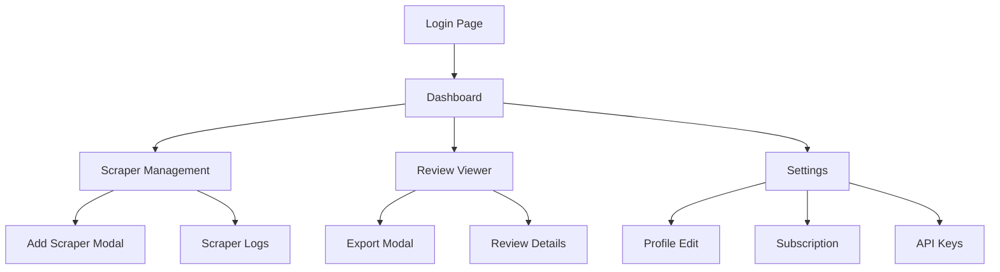

## 1. Product Overview

A comprehensive review scraping platform that automates the collection of customer reviews from multiple platforms (Google Maps, Yelp, TripAdvisor) and provides powerful analytics tools for businesses to monitor and analyze their online reputation.

The platform solves the problem of manually collecting reviews across different platforms by providing automated scraping, centralized data management, and insightful analytics. Businesses can track their reputation, identify trends, and export data for reporting purposes.

## 2. Core Features

### 2.1 User Roles

| Role | Registration Method | Core Permissions |
|------|---------------------|------------------|
| Free User | Email registration | Can create up to 3 scrapers, view 1000 reviews per month, basic exports |
| Basic User | Subscription upgrade | Can create up to 10 scrapers, view 10000 reviews per month, advanced exports |
| Premium User | Subscription upgrade | Unlimited scrapers, unlimited reviews, all export formats, priority support |
| Admin | System assignment | Full system access, user management, system configuration |

### 2.2 Feature Module

The Review Scraper platform consists of the following main pages:

1. **Login Page**: User authentication, password reset, registration
2. **Dashboard**: Statistics overview, recent activity, quick actions, data visualization
3. **Scraper Management**: Scraper configuration, status monitoring, bulk operations
4. **Review Viewer**: Review list, advanced filtering, search functionality, export options
5. **Settings**: User profile, subscription management, API keys, notification preferences

### 2.3 Page Details

| Page Name | Module Name | Feature description |
|-----------|-------------|---------------------|
| Login Page | Authentication Form | Email/password login with validation, remember me option, show/hide password toggle |
| Login Page | Registration Link | Link to registration form for new users with email verification |
| Login Page | Password Reset | Forgot password functionality with email confirmation |
| Dashboard | Statistics Cards | Display total reviews, active scrapers, export ready count, storage usage with real-time updates |
| Dashboard | Recent Activity | Show latest scraper runs, new reviews collected, export completions with timestamps |
| Dashboard | Quick Actions | Buttons for common tasks: add scraper, export data, view recent reviews |
| Dashboard | Data Visualization | Interactive charts showing review trends, platform distribution, rating breakdowns |
| Scraper Management | Scraper List Table | Display all user scrapers with name, platform, status, last run, total reviews |
| Scraper Management | Add Scraper Form | Modal with platform selection, URL input, scheduling options, advanced settings |
| Scraper Management | Bulk Operations | Select multiple scrapers for start, pause, or delete operations |
| Scraper Management | Status Indicators | Visual indicators for scraper status (active, paused, error, inactive) |
| Scraper Management | Action Buttons | Individual scraper controls: start, pause, edit, delete, view logs |
| Review Viewer | Review List | Paginated list of reviews with reviewer name, rating, date, platform, preview text |
| Review Viewer | Advanced Filters | Filter by platform, rating range, date range, sentiment, keyword search |
| Review Viewer | Review Details | Expandable view showing full review text, helpful count, business response |
| Review Viewer | Export Options | Export filtered results to Excel, CSV, PDF with custom formatting |
| Review Viewer | Sort Options | Sort by date, rating, platform, helpful count in ascending/descending order |
| Settings | Profile Management | Edit user name, email, password, profile picture upload |
| Settings | Subscription Details | View current plan, usage statistics, upgrade/downgrade options |
| Settings | API Configuration | Generate API keys, view usage limits, documentation links |
| Settings | Notification Preferences | Configure email notifications for scraper events, export completions |

## 3. Core Process

### User Registration Flow
1. User navigates to login page and clicks "Register"
2. User fills registration form with email, password, name
3. System validates input and sends verification email
4. User clicks verification link to activate account
5. User is redirected to login page with success message

### Dashboard Access Flow
1. User logs in with valid credentials
2. System authenticates and generates JWT token
3. User is redirected to dashboard page
4. Dashboard loads statistics from API
5. Recent activity feed updates in real-time
6. User can access quick actions and navigation

### Scraper Creation Flow
1. User clicks "Add New Scraper" on dashboard or scraper page
2. Modal opens with scraper configuration form
3. User selects platform (Google Maps/Yelp/TripAdvisor)
4. User enters target URL and business name
5. User configures schedule (manual/daily/weekly/monthly)
6. User sets advanced options (notifications, duplicate detection)
7. System validates configuration and saves scraper
8. Scraper appears in list with "inactive" status
9. User can start scraper to begin collection

### Review Export Flow
1. User navigates to review viewer page
2. User applies desired filters (platform, date, rating)
3. User clicks "Export" button
4. Export modal opens with format options (Excel/CSV/PDF)
5. User selects format and confirms export
6. System creates export job in background
7. User receives notification when export is ready
8. User downloads file from exports page or email link

### Page Navigation Flow

## 4. User Interface Design

### 4.1 Design Style

- **Primary Color**: #2563eb (Blue) - Main actions and highlights
- **Secondary Color**: #64748b (Slate) - Secondary text and borders
- **Success Color**: #10b981 (Green) - Success states and positive indicators
- **Warning Color**: #f59e0b (Amber) - Warning states and attention
- **Error Color**: #ef4444 (Red) - Error states and destructive actions

- **Button Style**: Rounded corners (6px), hover effects, clear primary/secondary hierarchy
- **Typography**: Inter font family, 16px base size, clear hierarchy with h1-h6
- **Layout Style**: Card-based design with consistent spacing (8px grid system)
- **Icons**: Heroicons for consistency, filled for active states, outline for default
- **Animation**: Subtle transitions (200ms), loading spinners, success checkmarks

### 4.2 Page Design Overview

| Page Name | Module Name | UI Elements |
|-----------|-------------|-------------|
| Login Page | Authentication Form | Centered card layout, company logo at top, input fields with icons, primary blue login button, secondary gray links |
| Dashboard | Statistics Cards | 4-column grid on desktop, stacked on mobile, card shadows, large numbers, small trend indicators, icon representations |
| Dashboard | Recent Activity | Timeline-style list with icons, alternating background colors, timestamp formatting, scrollable container |
| Dashboard | Data Visualization | Recharts library, responsive charts, interactive tooltips, color-coded data series, legend positioning |
| Scraper Management | Scraper List Table | Sortable columns, status badges with colors, action button group, pagination controls, search bar |
| Scraper Management | Add Scraper Modal | Multi-step form with progress indicator, platform icons, form validation feedback, test connection button |
| Review Viewer | Review List | Card-based layout with star ratings, platform badges, expandable sections, infinite scroll, loading skeletons |
| Review Viewer | Advanced Filters | Collapsible filter panel, date range picker, multi-select dropdowns, clear filters button, filter count badge |
| Settings | Profile Management | Form with avatar upload, field validation indicators, save/cancel buttons, success toast notifications |

### 4.3 Responsiveness

- **Mobile-First Approach**: Designed for mobile devices first, enhanced for larger screens
- **Breakpoints**: 640px (sm), 768px (md), 1024px (lg), 1280px (xl)
- **Touch Optimization**: Larger tap targets (44px minimum), swipe gestures for navigation
- **Adaptive Layouts**: Stack-to-grid transitions, collapsible sidebars, responsive tables
- **Performance**: Optimized images, lazy loading, code splitting for faster mobile experience

The platform prioritizes data density and functionality while maintaining clean, modern aesthetics suitable for business users who need to process large amounts of review data efficiently.