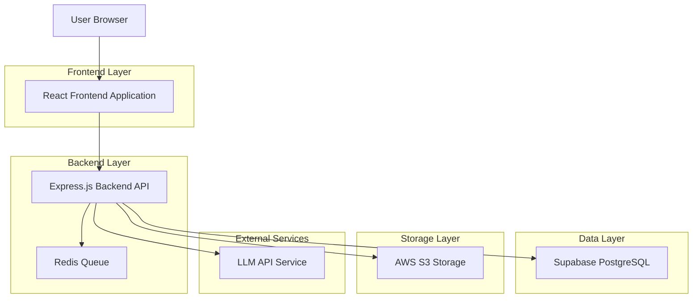
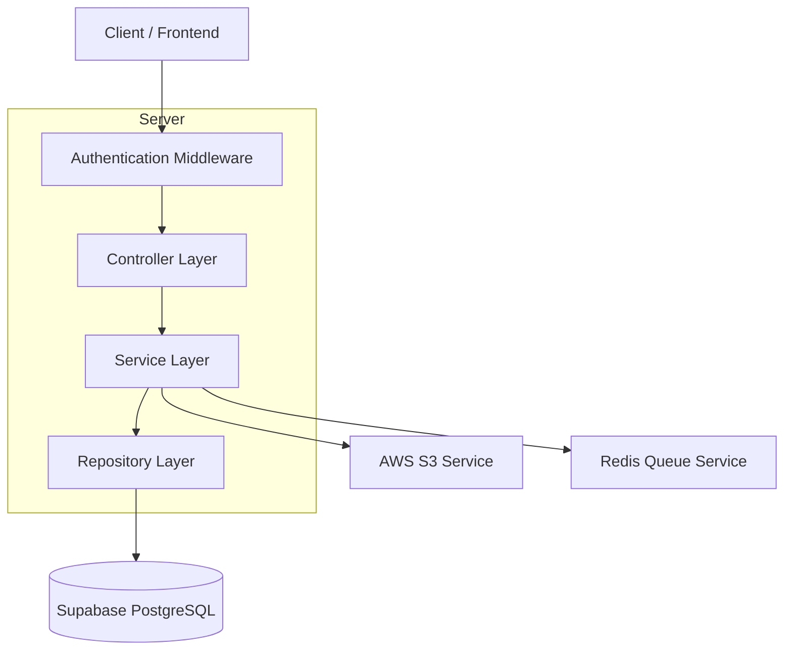
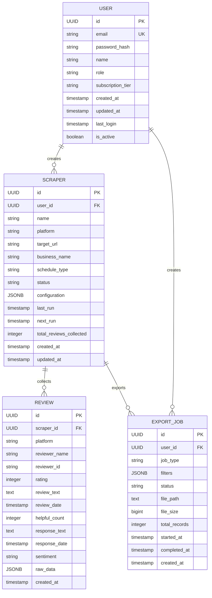

## 1. Architecture design



## 2. Technology Description

- Frontend: React@18 + TypeScript + Tailwind CSS + Vite
- Backend: Express.js@4 + TypeScript + Node.js
- Database: Supabase PostgreSQL
- Storage: AWS S3
- Queue System: Redis + Bull
- Authentication: JWT with Supabase Auth
- API Documentation: Swagger/OpenAPI

## 3. Route definitions

| Route | Purpose |
|-------|---------|
| / | Login page, user authentication entry point |
| /dashboard | Main dashboard with statistics and overview |
| /scrapers | Scraper management interface |
| /reviews | Review data viewer with filtering |
| /settings | User profile and account settings |
| /exports | Export job management |
| /auth/callback | Authentication callback handler |

## 4. API definitions

### 4.1 Core API

#### User Authentication
```
POST /api/auth/login
```

Request:
| Param Name | Param Type | isRequired | Description |
|------------|------------|------------|-------------|
| email | string | true | User email address |
| password | string | true | User password |

Response:
| Param Name | Param Type | Description |
|------------|------------|-------------|
| access_token | string | JWT access token |
| refresh_token | string | JWT refresh token |
| user | object | User profile data |

Example:
```json
{
  "email": "user@example.com",
  "password": "securepassword123"
}
```

#### Dashboard Statistics
```
GET /api/dashboard/stats
```

Headers:
| Header Name | Header Value | Description |
|-------------|--------------|-------------|
| Authorization | Bearer {token} | JWT access token |

Response:
| Param Name | Param Type | Description |
|------------|------------|-------------|
| total_reviews | integer | Total number of reviews |
| active_scrapers | integer | Number of active scrapers |
| export_ready | integer | Number of ready exports |
| storage_used | string | Storage usage percentage |

#### Scraper Management
```
POST /api/scrapers
```

Headers:
| Header Name | Header Value | Description |
|-------------|--------------|-------------|
| Authorization | Bearer {token} | JWT access token |

Request:
| Param Name | Param Type | isRequired | Description |
|------------|------------|------------|-------------|
| name | string | true | Scraper name |
| platform | string | true | Target platform (google_maps/yelp/tripadvisor) |
| target_url | string | true | URL to scrape |
| schedule_type | string | false | Schedule frequency (daily/weekly/monthly) |
| configuration | object | false | Platform-specific settings |

## 5. Server architecture diagram



## 6. Data model

### 6.1 Data model definition



### 6.2 Data Definition Language

#### Users Table
```sql
-- create table
CREATE TABLE users (
    id UUID PRIMARY KEY DEFAULT gen_random_uuid(),
    email VARCHAR(255) UNIQUE NOT NULL,
    password_hash VARCHAR(255) NOT NULL,
    name VARCHAR(100) NOT NULL,
    role VARCHAR(20) DEFAULT 'user' CHECK (role IN ('admin', 'user')),
    subscription_tier VARCHAR(20) DEFAULT 'free' CHECK (subscription_tier IN ('free', 'basic', 'premium')),
    created_at TIMESTAMP WITH TIME ZONE DEFAULT NOW(),
    updated_at TIMESTAMP WITH TIME ZONE DEFAULT NOW(),
    last_login TIMESTAMP WITH TIME ZONE,
    is_active BOOLEAN DEFAULT true
);

-- create indexes
CREATE INDEX idx_users_email ON users(email);
CREATE INDEX idx_users_role ON users(role);
CREATE INDEX idx_users_subscription ON users(subscription_tier);
```

#### Scrapers Table
```sql
-- create table
CREATE TABLE scrapers (
    id UUID PRIMARY KEY DEFAULT gen_random_uuid(),
    user_id UUID REFERENCES users(id) ON DELETE CASCADE,
    name VARCHAR(100) NOT NULL,
    platform VARCHAR(50) NOT NULL CHECK (platform IN ('google_maps', 'yelp', 'tripadvisor')),
    target_url TEXT NOT NULL,
    business_name VARCHAR(255),
    schedule_type VARCHAR(20) DEFAULT 'manual' CHECK (schedule_type IN ('manual', 'daily', 'weekly', 'monthly')),
    status VARCHAR(20) DEFAULT 'inactive' CHECK (status IN ('active', 'inactive', 'paused', 'error')),
    configuration JSONB,
    last_run TIMESTAMP WITH TIME ZONE,
    next_run TIMESTAMP WITH TIME ZONE,
    total_reviews_collected INTEGER DEFAULT 0,
    created_at TIMESTAMP WITH TIME ZONE DEFAULT NOW(),
    updated_at TIMESTAMP WITH TIME ZONE DEFAULT NOW()
);

-- create indexes
CREATE INDEX idx_scrapers_user_id ON scrapers(user_id);
CREATE INDEX idx_scrapers_platform ON scrapers(platform);
CREATE INDEX idx_scrapers_status ON scrapers(status);
CREATE INDEX idx_scrapers_created_at ON scrapers(created_at DESC);
```

#### Reviews Table
```sql
-- create table
CREATE TABLE reviews (
    id UUID PRIMARY KEY DEFAULT gen_random_uuid(),
    scraper_id UUID REFERENCES scrapers(id) ON DELETE CASCADE,
    platform VARCHAR(50) NOT NULL,
    reviewer_name VARCHAR(255),
    reviewer_id VARCHAR(255),
    rating INTEGER CHECK (rating >= 1 AND rating <= 5),
    review_text TEXT,
    review_date TIMESTAMP WITH TIME ZONE,
    helpful_count INTEGER DEFAULT 0,
    response_text TEXT,
    response_date TIMESTAMP WITH TIME ZONE,
    sentiment VARCHAR(20) DEFAULT 'neutral' CHECK (sentiment IN ('positive', 'negative', 'neutral')),
    raw_data JSONB,
    created_at TIMESTAMP WITH TIME ZONE DEFAULT NOW()
);

-- create indexes
CREATE INDEX idx_reviews_scraper_id ON reviews(scraper_id);
CREATE INDEX idx_reviews_platform ON reviews(platform);
CREATE INDEX idx_reviews_rating ON reviews(rating);
CREATE INDEX idx_reviews_review_date ON reviews(review_date DESC);
CREATE INDEX idx_reviews_sentiment ON reviews(sentiment);
CREATE INDEX idx_reviews_created_at ON reviews(created_at DESC);
```

#### Export Jobs Table
```sql
-- create table
CREATE TABLE export_jobs (
    id UUID PRIMARY KEY DEFAULT gen_random_uuid(),
    user_id UUID REFERENCES users(id) ON DELETE CASCADE,
    job_type VARCHAR(50) NOT NULL CHECK (job_type IN ('excel', 'csv', 'pdf')),
    filters JSONB,
    status VARCHAR(20) DEFAULT 'pending' CHECK (status IN ('pending', 'processing', 'completed', 'failed')),
    file_path TEXT,
    file_size BIGINT,
    total_records INTEGER,
    started_at TIMESTAMP WITH TIME ZONE,
    completed_at TIMESTAMP WITH TIME ZONE,
    created_at TIMESTAMP WITH TIME ZONE DEFAULT NOW()
);

-- create indexes
CREATE INDEX idx_export_jobs_user_id ON export_jobs(user_id);
CREATE INDEX idx_export_jobs_status ON export_jobs(status);
CREATE INDEX idx_export_jobs_created_at ON export_jobs(created_at DESC);
```

-- Grant permissions for Supabase
GRANT SELECT ON users TO anon;
GRANT ALL PRIVILEGES ON users TO authenticated;
GRANT SELECT ON scrapers TO anon;
GRANT ALL PRIVILEGES ON scrapers TO authenticated;
GRANT SELECT ON reviews TO anon;
GRANT ALL PRIVILEGES ON reviews TO authenticated;
GRANT SELECT ON export_jobs TO anon;
GRANT ALL PRIVILEGES ON export_jobs TO authenticated;